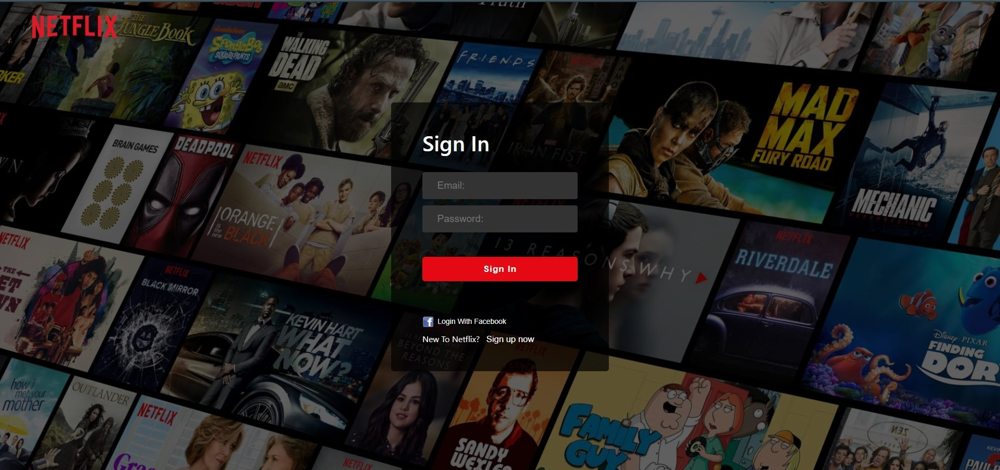

# NETFLIX WEB CLONE

## Facebook Authentication(Pop-Up) and Email/Password Auth

### Login Form (Email/Password)



### NetFlix Clone Home Page


## Tech Used:

1. [Create React App](https://github.com/facebook/create-react-app) -> for creating the ReactJS Project.
2. [Firebase](https://github.com/firebase/firebaseui-web) -> For the Deployment of the Project and Authentication.
3. [Material-ui](https://github.com/mui-org/material-ui) -> For Some Easly-Available Components
4. [Axios](https://github.com/axios/axios) -> Used for fetching the Movies Data from TMDB.
5. [react-youtube](https://github.com/tjallingt/react-youtube) and [movie-trailer](https://github.com/lacymorrow/movie-trailer) -> For the video Purpose

## Installation

```
npm install
```

## Update Firebase Config File with your Firebase Config

## Start The App

```
npm start
```

## Build The Project

```
npm run build
```
